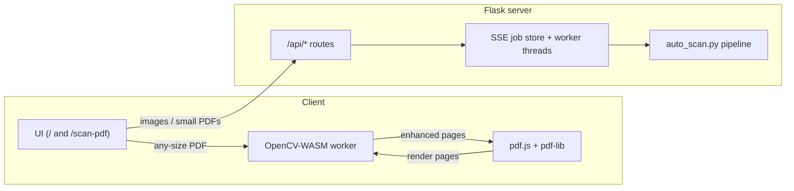

# RScan — Smart Document Scanner

[](LICENSE)
[](https://www.python.org/)
[](https://flask.palletsprojects.com/)
[](https://opencv.org/)
[](https://github.com/minhazexo/cam-clone/actions/workflows/ci.yml)
[](https://vercel.com/new/clone?repository-url=https://github.com/minhazexo/cam-clone)

A CamScanner-style document scanner for the web. Turn phone photos and PDFs into clean, flat, high-contrast scans with uniform A4 pages — on the server **or fully on-device** (no size limits, no uploads).

[](https://vercel.com/new/clone?repository-url=https://github.com/minhazexo/cam-clone)

---

## Highlights

| | |
|---|---|
| **Two scan paths** | Server API (Flask + OpenCV + PyMuPDF) and on-device (`/scan-pdf`: pdf.js + OpenCV-WASM + pdf-lib) with near bit-exact parity (MAD ≤ 0.05). |
| **Reference-quality output** | Perspective/contour warp, ruling-based dewarp & keystone correction, auto deskew (incl. colored rulings), margin trims, illumination flatten, white/black-point stretch with color-preserving ink, light unsharp. |
| **Clean A4 pages** | Every output page is uniform A4 (portrait/landscape matched), full-bleed, thin black frame — no giant pixel pages, no white borders. |
| **Live progress** | Server PDF jobs stream per-page events over SSE; the browser path shows the same step log + progress bar locally. |
| **Page-limit picker** | 10 / 20 / 30 / 40 / 50 / All on both scan pages (local caps: 250 MB, 250 pages). |
| **Phone-photo aware** | EXIF orientation is honored on upload (sideways scans come out upright). |
| **Private by default** | Images/PDFs stay on your machine when you run locally; the on-device path never uploads anything. |
| **Deploy-ready** | One-click Vercel deploy, `/api/health` probe, no API keys required. |

## Table of contents

- [Quickstart](#quickstart)
- [Usage](#usage)
- [API](#api)
- [Architecture](#architecture)
- [Project structure](#project-structure)
- [Configuration](#configuration)
- [Development & verification](#development--verification)
- [Deploy (Vercel)](#deploy-vercel)
- [Tech stack](#tech-stack)
- [Contributing](#contributing)
- [Security](#security)
- [License](#license)

## Quickstart

### Prerequisites

- **Python 3.9+** and **pip**
- Optional: [Bun](https://bun.sh) (only needed to rebuild vendored frontend assets; prebuilt files are committed)

### Run locally

```bash
git clone https://github.com/minhazexo/cam-clone.git
cd cam-clone

python -m venv .venv
# Windows:  .venv\Scripts\activate
# macOS/Linux:
source .venv/bin/activate

pip install -r requirements.txt   # headless OpenCV — no libGL needed
bun run build                     # optional: vendor runtime.js + pdf.worker.js
                                  # (opencv.js is pre-vendored; skip if files exist)
python app.py                     # → http://localhost:5000
```

Open **`/`** for images + server PDF scans, or **`/scan-pdf`** for the unlimited on-device flow (click **Scan PDF** on the home page).

> **No Bun?** The repo already contains `static/vendor/runtime.js` and `static/vendor/pdf.worker.js`. You can run `python app.py` immediately after `pip install`.

## Usage

| Flow | Where | Notes |
|---|---|---|
| Scan images | `/` → **Scan Images** | Multi-file, deduped, EXIF-corrected, JPEG q95 back |
| Scan PDF (on-device) | `/` → **Scan PDF** (or `/scan-pdf`) | Any size; engine WASM downloads once (~10 MB, cached) |
| Scan PDF (server, SSE) | `/` → drop a PDF on the upload zone | Page-limit modal, live `page_done` events |
| CLI single/batch | `python RScan/Python/scan/scan_pdf.py in.pdf out.pdf [--dpi 200] [--jpeg-quality 78] [--page-size A4\|Letter\|keep] [--margin 0] [--no-border] [--output-scale 1.0]` | Same defaults as the server |
| Quality gate | `python RScan/Python/scan/quality_gate.py` | Reference-anchored regression checks (needs reference assets) |

### API

| Endpoint | Method | Description |
|---|---|---|
| `/` | GET | Web UI (images + server PDF) |
| `/scan-pdf` | GET | On-device scan page |
| `/api/health` | GET | `{status, service}` liveness probe |
| `/api/scan` | POST | `files[]` images → `{pages: [{name, id, width, height}]}` (PDFs rejected: use a PDF flow) |
| `/api/scan-pdf` | POST | Legacy single-shot PDF → `{pdf}` |
| `/api/scan-pdf-start` | POST | Starts background job → `{job_id}` |
| `/api/scan-pdf-progress/<job_id>` | GET (SSE) | `loading → detected → scanning → page_done → assembling → done` |
| `/api/image/<id>` · `/api/pdf/<name>` | GET | Serve results (best-effort on serverless) |

**Example — scan an image:**

```bash
curl -F "files=@photo.jpg" http://localhost:5000/api/scan
# → {"pages":[{"name":"photo.jpg","id":"…","width":…,"height":…}]}
```

**Example — health check:**

```bash
curl http://localhost:5000/api/health
# → {"service":"rscan","status":"ok"}
```

## Architecture



- **Server path:** upload → OpenCV pipeline (`RScan/Python/scan/auto_scan.py`) → JPEG/PDF results; PDFs run as background jobs with SSE progress.
- **On-device path:** pdf.js renders each page → `scan-worker-v2.js` (OpenCV.js) enhances pixels → pdf-lib assembles an A4 PDF — nothing leaves the browser.

## Project structure

```
app.py                  # Flask app: routes, SSE job store, PDF worker threads
api/index.py            # Vercel entrypoint (re-exports app)
RScan/Python/scan/
  auto_scan.py          # core pipeline: geometry → photometry → reframe
  scan.py               # legacy GCMODE/RMODE/SMODE + functional API
  scan_pdf.py           # PDF/image/dir → scanned PDF (DPI, quality, A4, border)
  quality_gate.py       # offline regression gate vs reference
templates/              # index.html (main UI), scan_pdf.html (on-device page)
static/css/             # design-system stylesheet
static/js/              # app.js, scanpdf.js (page flow), scan-worker-v2.js (pipeline),
                        # scan-geometry.js (geometry port), opencv-loader.js, scan-worker.js (fallback)
static/vendor/          # runtime.js, pdf.worker.js (built) + opencv.js 4.8.0 (vendored)
scripts/                # build.ts, check.ts, gen_fixtures.py, dump_stages.py
tests/                  # parity harnesses (parity_worker/geometry/full) + fixtures
docs/                   # deep-dive docs (local only, git-ignored)
.github/                # CI, issue & PR templates
```

## Configuration

Copy [`.env.example`](.env.example) to `.env` (optional — defaults work out of the box):

| Variable | Default | Description |
|---|---|---|
| `PORT` | `5000` | HTTP port for `python app.py` |
| `RSCAN_DEBUG` | `0` | `1` enables verbose Flask/OpenCV logs |

No API keys required.

## Development & verification

```bash
bun run build         # rebuild static/vendor/runtime.js + copy pdf.worker.js
bun run check         # assert vendor artifacts are present
bun run parity        # all three parity harnesses (worker, geometry, full)

python scripts/gen_fixtures.py   # regenerate synthetic fixtures
python scripts/dump_stages.py    # per-stage reference bytes for new fixtures
```

CI (GitHub Actions) runs vendor checks, the parity suite, and a Python import smoke test on every push and pull request.

## Deploy (Vercel)

1. Import this repo in Vercel (framework: **Other**, root: repo root). No build command needed.
2. Deploy, then verify `https://<project>.vercel.app/api/health` → `{"status":"ok"}`.
3. Open `/scan-pdf` and wait for **“Scan engine ready (v2-full)”**.

### Serverless limits (honest matrix)

| Concern | Local (`python app.py`) | Vercel Hobby |
|---|---|---|
| Request body | 50 MB | ~4.5 MB |
| Request time | unlimited | ~60 s |
| Disk | your machine | ephemeral |
| Large PDF scans | ✅ | use **`/scan-pdf`** (on-device) |
| Image scans | ✅ | ✅ (small batches) |

The `/scan-pdf` page never touches the server, so it is unaffected by function limits.

## Tech stack

**Backend:** Flask 3 · OpenCV (headless) · NumPy · PyMuPDF · Pillow  
**Frontend:** vanilla JS · pdf.js 3.11 · pdf-lib · opencv.js 4.8 (WASM) · Inter  
**Tooling:** Bun build · Node parity tests · GitHub Actions · Vercel

## Contributing

Contributions are welcome — bug reports, fixes, docs, and parity improvements.

1. Fork and create a branch: `git checkout -b feat/my-change`
2. Run `bun run check && bun run parity` (and `python -m compileall app.py` for Python changes)
3. Open a pull request using the template

Full guidelines: [CONTRIBUTING.md](CONTRIBUTING.md) · Code of conduct: [CODE_OF_CONDUCT.md](CODE_OF_CONDUCT.md)

## Security

Please report vulnerabilities privately — see [SECURITY.md](SECURITY.md). Do not open public issues for security reports.

## Changelog

See [CHANGELOG.md](CHANGELOG.md).

## License

[GPL-3.0](LICENSE) — free to use, modify, and redistribute under the same license.

Origin: **RScan** by Sourabh Khemka; web product, Tier-1 pipeline, and on-device port developed on top.
